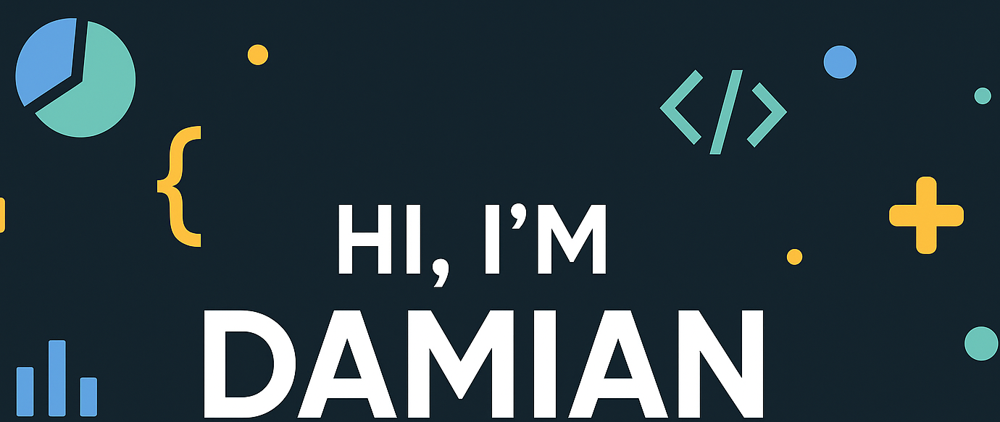

<!-- Cover Banner -->

### 👋 Hey there

I’m Damian – AL developer by profession, Python enthusiast by passion, and someone who has too many tabs open (both in my browser and in life).  

My coding path kicked off with basic websites (hello, HTML & CSS!), quickly turned into “let’s try JavaScript,” and somehow spiraled into building Django apps and Kotlin-based Android projects. Why? Because I love figuring out how things work across platforms – and I enjoy the little chaos that comes with it.  

Currently, I write AL code for Microsoft Dynamics 365 Business Central (yes, it’s a thing!), while diving into the world of machine learning after hours – trying to teach computers how to think, even when I barely can before coffee.  

What truly matters to me is **readable, structured, and maintainable** code – not just code that works, but code that doesn't make future-me cry.  

Let’s build something cool — and please follow the style guide, your teammates (and your future self) will thank you. 😉

## 🌐 Socials:
 

# 💼 Skills:
 
 
 
 
         

More Skills

 

 
 
 
 

 

 

 

 
      
 
 
 
 
   
 
 

 

## 📣 How about an Office quote before you go?

> “Code is like humor - if you have to explain it, it's bad.”
>
> 
- Unkown

 

# 📊 GitHub Stats:

  
  
  
  

 

 
 

